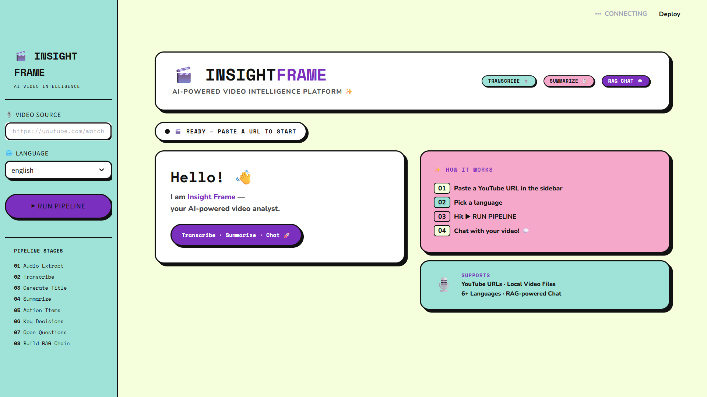

# 🎬 Insight Frame

**AI-Powered Video Intelligence Platform**
Transcribe · Summarize · Analyze · Chat with Videos

Insight Frame is an AI-powered video assistant that converts video content into structured, actionable insights. It extracts audio from YouTube videos or local files, transcribes speech into text, generates summaries, identifies action items, key decisions, and open questions, and enables intelligent Q&A using Retrieval-Augmented Generation (RAG).

---

## 🌐 Web UI Preview



---

## ✨ Features

* 🎥 Process YouTube videos or local video files
* 🎙️ Audio extraction and preprocessing
* 📝 Automatic speech transcription
* 📋 AI-powered summarization
* ✅ Extract action items
* 🔑 Identify key decisions
* ❓ Detect open questions
* 💬 Chat with video using RAG
* 🎨 Brutalist Streamlit UI

---

## 🏗️ Architecture

Insight Frame follows a multi-stage AI pipeline:

```text
Video Input
   ↓
Audio Extraction
   ↓
Transcription
   ↓
Summarization
   ↓
Metadata Extraction
   ↓
RAG Engine
   ↓
Interactive Chat
```

---

# 🚀 Pipeline Overview

## 1. Environment & Project Setup

* Set up Python virtual environment
* Configure `.env` for API keys
* Install required dependencies

### Required APIs

* Mistral AI
* Sarvam AI (optional)

### Core Dependencies

* Streamlit
* LangChain
* ChromaDB
* yt-dlp
* FFmpeg
* Whisper

---

## 2. Audio Processing Pipeline

Audio is extracted from:

* YouTube URLs
* Local video files

### Tools Used

* `yt-dlp`
* `FFmpeg`

### Processing Steps

* Extract audio
* Convert to mono
* Set sample rate to 16kHz
* Optimize for transcription

---

## 3. Transcription Engine

Speech is converted into text using:

* OpenAI Whisper (local transcription)

### Benefits

* Accurate speech-to-text
* Free local inference
* Works well for English

---

## 4. AI Analysis & Summarization

Transcript is processed by LLMs to generate insights.

### Outputs

* Title generation
* Summary
* Action items
* Key decisions
* Open questions

### AI Stack

* Mistral AI
* LangChain

---

## 5. RAG Implementation (Chat with Video)

Users can ask questions directly about video content.

### Workflow

1. Split transcript into chunks
2. Generate embeddings
3. Store in vector database
4. Retrieve relevant context
5. Generate AI answer

### Tech Stack

* HuggingFace Embeddings
* ChromaDB
* LangChain RAG

---

## 6. User Interface

Frontend built with **Streamlit**.

### UI Components

* Sidebar for input
* Pipeline status tracker
* Summary dashboard
* Transcript viewer
* Chat interface

---

# 📂 Project Structure

```bash
Insight-Frame/
│
├── main.py
├── requirements.txt
├── .env
│
├── core/
│   ├── transcriber.py
│   ├── summarizer.py
│   ├── extractor.py
│   └── rag_engine.py
│
├── utils/
│   └── audio_processor.py
│
└── assets/
    └── insight-frame-ui.png
```

---

# ⚙️ Installation

Clone repository:

```bash
git clone https://github.com/yourusername/insight-frame.git
cd insight-frame
```

Create virtual environment:

```bash
python -m venv venv
```

Activate environment:

### Windows

```bash
venv\Scripts\activate
```

### Mac/Linux

```bash
source venv/bin/activate
```

Install dependencies:

```bash
pip install -r requirements.txt
```

---

# 🔐 Environment Variables

Create `.env`

```env
MISTRAL_API_KEY=your_key_here
SARVAM_API_KEY=your_key_here
```

---

# ▶️ Run Application

```bash
streamlit run main.py
```

---

# 🧠 Future Improvements

* Multi-language transcription
* PDF export
* Meeting analytics dashboard
* Speaker diarization
* Faster inference with caching
* Cloud deployment

---

# 📌 Tech Stack

* Python
* Streamlit
* LangChain
* ChromaDB
* Whisper
* Mistral AI
* HuggingFace
* FFmpeg

---

# 👨‍💻 Author

Built by **Abhay Vishwakarma**

**Insight Frame — Transform videos into intelligence.** 🚀
